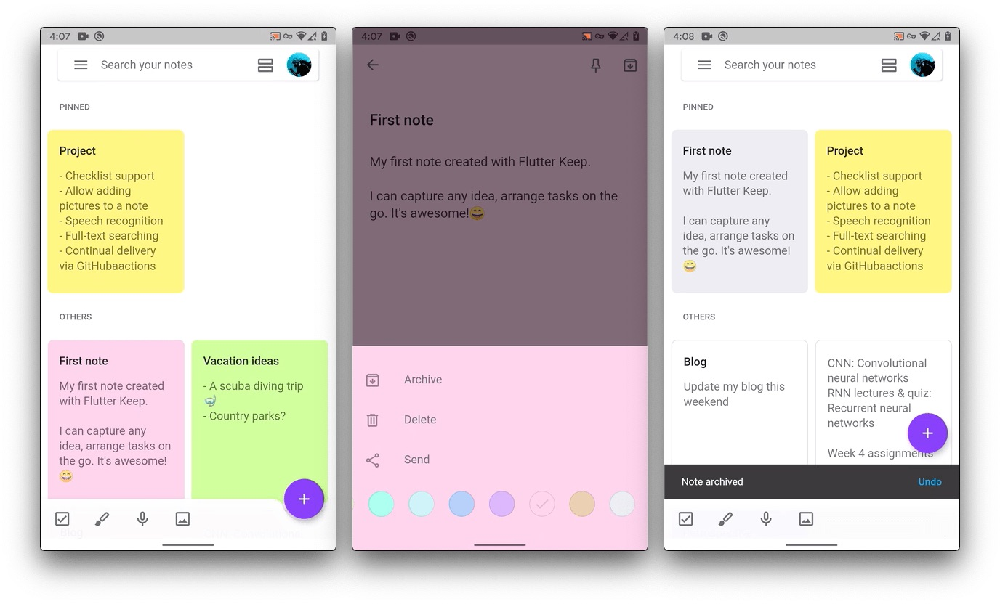
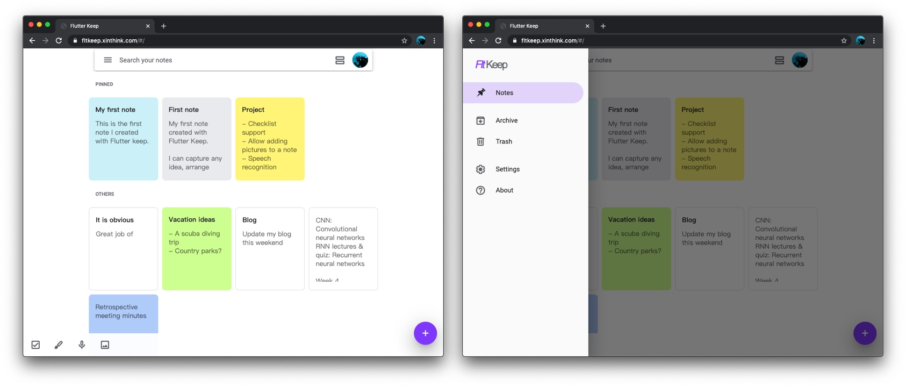

---

[![Check Status][check-badge]][check-link]
[![MIT][license-badge]][license]

This is a simplified [Google Keep] mobile app 'clone' built with [Flutter] + [Firebase]. For practicing prototyping and Flutter skills only.

If you love to, please read the [series of stories] on Medium to find out how to create an app like this from scratch.

Screenshots:

Web app screenshots:

[][web app]

[web app]: https://fltkeep.xinthink.com
[Flutter]: https://flutter.dev
[Firebase]: https://firebase.google.com/
[Google Keep]: https://www.google.com/keep/
[check-badge]: https://github.com/xinthink/flutter-keep/workflows/check/badge.svg
[check-link]: https://github.com/xinthink/flutter-keep/actions?query=workflow%3Acheck
[license-badge]: https://img.shields.io/github/license/xinthink/flutter-keep
[license]: https://github.com/xinthink/flutter-keep/blob/master/COPYING
[series of stories]: https://medium.com/flutter-community/build-a-note-taking-app-with-flutter-firebase-part-i-53816e7a3788
